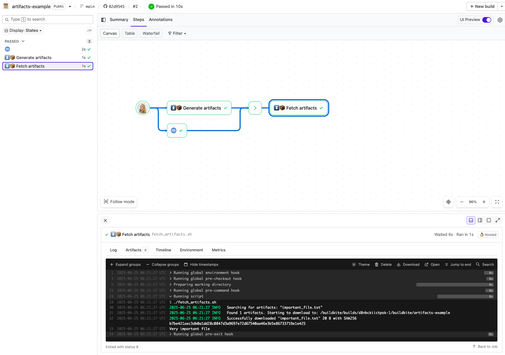

# Buildkite Artifact Pipeline Example

This repository is an example [Buildkite](https://buildkite.com/) pipeline that shows how to generate and download [build artifacts](https://buildkite.com/docs/guides/artifacts) across build steps (which could be running on different build machines for example).

👉 **Live Pipeline:** [buildkite.com/buildkite/artifacts-example](https://buildkite.com/buildkite/artifacts-example)

See the full [Getting Started Guide](https://buildkite.com/docs/guides/getting-started) for step-by-step instructions on how to get this running, or [Add to Buildkite](https://buildkite.com/new) to try it yourself.

## How it works
There are two example steps:

* [generate_artifacts.sh](generate_artifacts.sh) - this creates a simple artifact
* [fetch_artifacts.sh](fetch_artifacts.sh) - this fetches and prints the artifact

## License

See [Licence.md](Licence.md) (MIT)
